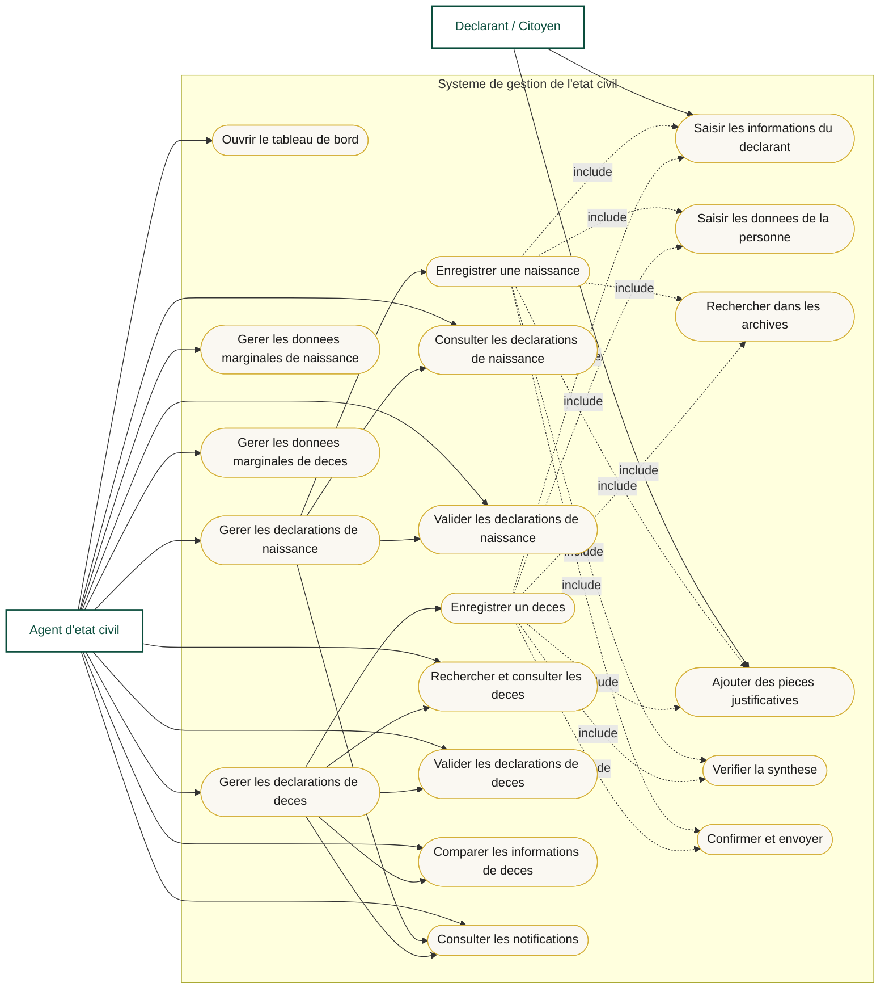
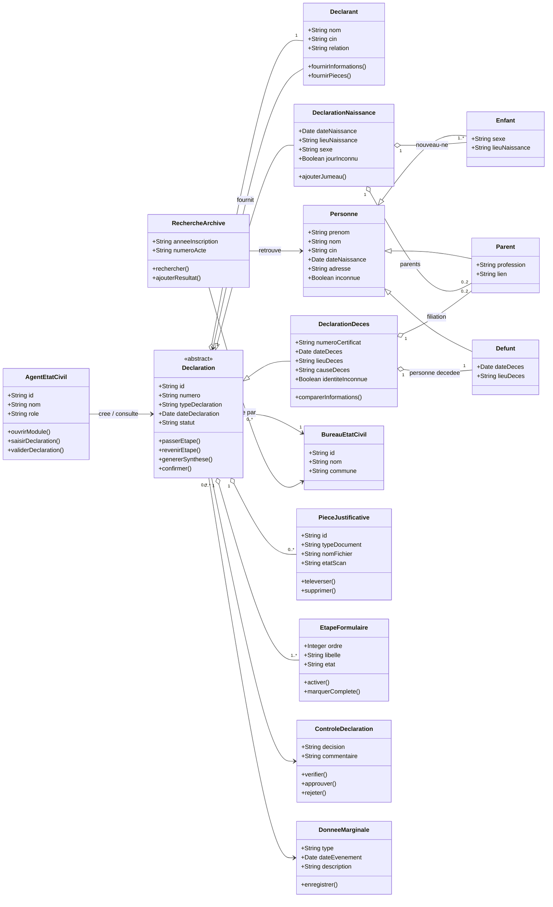
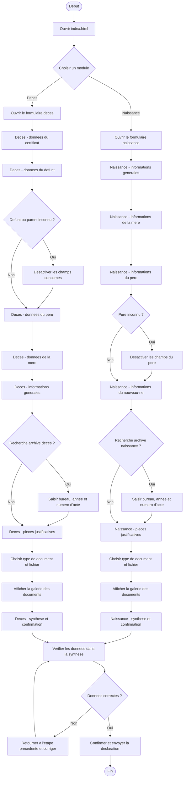

# Diagrammes UML - Systeme de l'etat civil

Ces diagrammes decrivent l'application actuelle: un tableau de bord pour les declarations de naissance et de deces, avec formulaires multi-etapes, pieces justificatives, recherche dans les archives et validation finale.

Format choisi: **Mermaid dans Markdown**. Il peut etre affiche dans GitHub, VS Code avec extension Mermaid, ou sur https://mermaid.live.

## 1. Diagramme de cas d'utilisation

## 2. Diagramme de classes

## 3. Diagramme de flux / activite

## Notes

- Le diagramme de flux est un **diagramme d'activite**: il represente le parcours utilisateur et les decisions principales.
- Le diagramme de classes est conceptuel: le projet actuel est en HTML/CSS/JS statique, donc les classes representent le modele metier attendu plutot que des classes JavaScript existantes.
